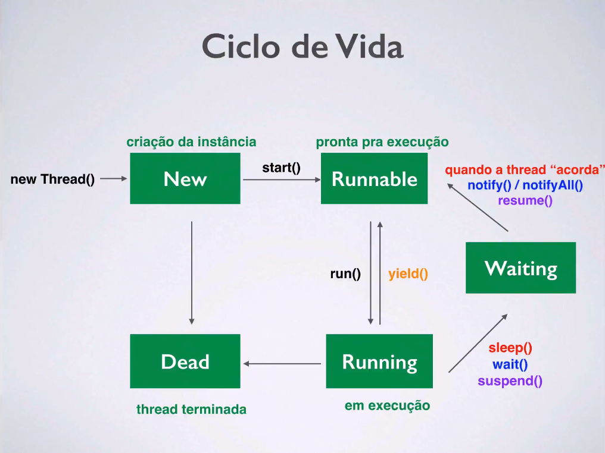

# RESUMO DE THREADS COM JAVA

#### Clico de vida de uma thread



#### Implementação

Há duas maneiras de implementar Threads no Java

* Estendendo a classe Thread
* Implementando a interface Runnable

### Classe Thread

Para a implementação é essencial que a classe estenda de Thread, isso é feito através de `extends Thread`

##### Métodos básicos da classe Thread
* `.start()` => Irá iniciar a Thread
* `run()` => Conterá o código que será executado quando a thread for iniciada, caso não seja implementado a thread não faz nada
* `sleep(x)` => Bota a thread para "dormir" por x milissegundos. *Esse método requisita estar dentro de um try-catch pois poderá dar uns erros malucos

Feito isso basta criar a implementação da Thread

Há dois pontos essenciais que não podem ser esquecidos
1. Iniciar a thread através do `.start()`, se tu não fez isso teu programa vai fazer nada boy
2. Implementar a sua classe `run()`

##### Exemplo 1 - Basicão

```
public class MinhaThread extends Thread {

	public static void main(String[] args) {
		// TODO Auto-generated method stub
		MinhaThread thread = new MinhaThread("Thread #1");
		thread.start();
	}

	private String nome;

	public MinhaThread(String nome) {
		this.nome = nome;
	}

	public void run() {
		System.out.println("Executando a thread :" + nome);

	}

}

```

##### Exemplo 2 - Threads contando e dormindo
```
public class MinhaThread extends Thread {

	public static void main(String[] args) {
		// TODO Auto-generated method stub
		MinhaThread thread = new MinhaThread("Thread #1", 600);
		MinhaThread thread2 = new MinhaThread("Thread #2", 900);
		MinhaThread thread3 = new MinhaThread("Thread #3", 200);
	}

	private String nome;
	private int tempo;

	public MinhaThread(String nome, int tempo) {
		this.nome = nome;
		this.tempo = tempo;
		start();
	}

	public void run() {
		for(int i=0; i<6; i++) {
			System.out.println(nome + " contador " + i);
			try {
				Thread.sleep(tempo);
			} catch (InterruptedException e) {
				// TODO Auto-generated catch block
				e.printStackTrace();
			}
		}
	}

}
```

### Interface Runnable

Para a implementação é essencial que a classe Runnable seja implementado, isso é feito através de `implements Runnable`
Logo após, aparecerá um erro, pois o método `run()` é obrigatório para essa implementação, e até então tu não criou ele boy

Mas a diferença dessa implementação é que você precisará criar uma classe contendo o que você quer que a thread faça, e passa-la para a thread através do código `Thread minhaThread = new Thread(threadComRunnable);` e logo após  executa-la através do `minhaThread.start();`

##### Exemplo 3 - Threads contando e dormindo com Runnable
```
public class MinhaThreadRunnable implements Runnable {

	public static void main(String[] args) {
		// TODO Auto-generated method stub
		MinhaThreadRunnable thread = new MinhaThreadRunnable("Thread #1", 600);
		MinhaThreadRunnable thread2 = new MinhaThreadRunnable("Thread #2", 900);
		MinhaThreadRunnable thread3 = new MinhaThreadRunnable("Thread #3", 200);

		Thread t1 = new Thread(thread);
		Thread t2 = new Thread(thread2);
		Thread t3 = new Thread(thread3);

		t1.start();
		t2.start();
		t3.start();
	}

	private String nome;
	private int tempo;

	public MinhaThreadRunnable(String nome, int tempo) {
		this.nome = nome;
		this.tempo = tempo;
	}

	public void run() {
		for(int i=0; i<6; i++) {
			System.out.println(nome + " contador " + i);
			try {
				Thread.sleep(tempo);
			} catch (InterruptedException e) {
				// TODO Auto-generated catch block
				e.printStackTrace();
			}
		}
		System.out.println(nome + " terminou a execução!");
	}

}
```

#### Classe Thread VS Interface Runnable

* Quando fazemos extends na *Thread*, o único método que precisa ser sobreposto é o *run*
* Quando implementamos *Runnable*, precisamos obrigatóriamente implementar o método *run*
* Com a classe *Runnable*, podemos extender qualquer outra classe
* Se não for sobrepor qualquer outro método da classe *Thread*, pode ser melhor usar a classe *Runnable*
* O professor Cornélio em quase todos seus exemplos implementa threads através da classe *Runnable*

### Mais implementações da Interface Runnable

#### .isAlive()

Retorna um boleno informando se a Thread está vida ou não; `true` se a thread está "viva" e ~~pau no seu cu~~`false` se ela estiver "morta"

#### exemplo do .isAlive()
```
public class MinhaThreadRunnable implements Runnable {

	public static void main(String[] args) {
		// TODO Auto-generated method stub
		MinhaThreadRunnable thread = new MinhaThreadRunnable("Thread #1", 600);

		Thread t1 = new Thread(thread);
		t1.start();

		System.out.println(t1.isAlive());
	}

	private String nome;
	private int tempo;

	public MinhaThreadRunnable(String nome, int tempo) {
		this.nome = nome;
		this.tempo = tempo;
	}

	public void run() {
		for(int i=0; i<6; i++) {
			System.out.println(nome + " contador " + i);
			try {
				Thread.sleep(tempo);
			} catch (InterruptedException e) {
				// TODO Auto-generated catch block
				e.printStackTrace();
			}
		}
		System.out.println(nome + " terminou a execução!");
	}

}
```

#### .join() || .join(x)

Este comando só executará o resto do código quando a thread terminar sua execução. Também poderar conter um inteiro como argumento que é a quantidade de millisegundos que ela deverá esperar

Ex:
`minhaThread.join();`
`System.out.println("A thread terminou sua execução!");`
=> Irá imprimir o texto quando a thread terminar de executar
Ex2:
`minhaThread.join(200);`
`System.out.println("A thread terminou sua execução!");`
=> Irá imprimir o texto quando a thread terminar de executar OU após ela estar em execução a 200 millisegundos

o método join requisita estar dentro de um try-catch ou que sua classe contenha o `throws InterruptedException` pois poderá dar uns erros malucos

#### exemplo do .join()

Imprimirá um texto somente quando as duas threads chegarem ao fim.

```
public class MinhaThreadRunnable implements Runnable {

	public static void main(String[] args) throws InterruptedException {
		// TODO Auto-generated method stub
		MinhaThreadRunnable thread = new MinhaThreadRunnable("Thread #1", 600);
        MinhaThreadRunnable thread2 = new MinhaThreadRunnable("Thread #2", 900);

		Thread t1 = new Thread(thread);
        Thread t2 = new Thread(thread2);

		t1.start();
        t2.start();

		t1.join();
        t2.join();

		System.out.println("O programa chegou ao fim");
	}

	private String nome;
	private int tempo;

	public MinhaThreadRunnable(String nome, int tempo) {
		this.nome = nome;
		this.tempo = tempo;
	}

	public void run() {
		for(int i=0; i<6; i++) {
			System.out.println(nome + " contador " + i);
			try {
				Thread.sleep(tempo);
			} catch (InterruptedException e) {
				// TODO Auto-generated catch block
				e.printStackTrace();
			}
		}
		System.out.println(nome + " terminou a execução!");
	}

}
```

#### .setPriority(x)

Irá definir a prioridade da execução da thread

O x poderá ser números de 1 à 10. Quanto maior o número maior a prioridade!

O x também poderá ser um argumento já presente na classe que é `Thread.MAX_PRIORTY`,`Thread.MIN_PRIORTY` ou `Thread.NORM_PRIORTY`. Que já tem nomes auto explicativos

OBS: Seu funcionamento não é 100%, irá variar a depender do SO e talz

#### exemplo do .setPriority(x)

Definindo prioridades para 3 threads

```
public class MinhaThreadRunnable implements Runnable {

	public static void main(String[] args) throws InterruptedException {
		// TODO Auto-generated method stub
		MinhaThreadRunnable thread = new MinhaThreadRunnable("Thread #1", 600);
        MinhaThreadRunnable thread2 = new MinhaThreadRunnable("Thread #2", 900);
        MinhaThreadRunnable thread3 = new MinhaThreadRunnable("Thread #3", 200);

		Thread t1 = new Thread(thread);
        Thread t2 = new Thread(thread2);
        Thread t3 = new Thread(thread3);

        t1.setPriority(10);
        t2.setPriority(5);
        t3.setPriority(1);

		t1.start();
        t2.start();
        t3.start();
	}

	private String nome;
	private int tempo;

	public MinhaThreadRunnable(String nome, int tempo) {
		this.nome = nome;
		this.tempo = tempo;
	}

	public void run() {
		for(int i=0; i<6; i++) {
			System.out.println(nome + " contador " + i);
			try {
				Thread.sleep(tempo);
			} catch (InterruptedException e) {
				// TODO Auto-generated catch block
				e.printStackTrace();
			}
		}
		System.out.println(nome + " terminou a execução!");
	}

}

```

#### synchronized

A sincronização serve para coordenar as atividades de 2 ou mais threads, pois quando duas threads tentam acessar um recurso, como uma variável, ao mesmo tempo, somente uma irá conseguir ter acesso ao mesmo e bloqueará o acesso do mesmo para a outra.

E para garantir que ambas terão acesso igual utilizamos a palavra chave synchronized em métodos ou em um bloco de código

Também é possíel sincronizar recursos, e isso será feito através da sincronização em blocos.

ex:
```
synchronized( this ){
	...
}
```

este exemplo irá sincronizar o acesso a todas as vairáveis da classe.

#### exemplo de programa sem synchronized

Uma calculadora que soma um vetor com números de 1 a 5

O resultado esperado é 15

```
public class MinhaThreadSoma implements Runnable{

	public static void main(String[] args) {
		int[] array = {1,2,3,4,5};

		MinhaThreadSoma thread1 = new MinhaThreadSoma("#1", array);
		MinhaThreadSoma thread2 = new MinhaThreadSoma("#2", array);
	}

	private String nome;
	private int[] nums;
	private static Calculadora calc = new Calculadora();

	public MinhaThreadSoma(String nome, int[] nums) {
		this.nome = nome;
		this.nums = nums;
		new Thread(this, nome).start();
		//t.start();
	}

	public void run() {

		System.out.println(this.nome + " iniciada");

		int soma = calc.somaArray(this.nums);

		System.out.println("Resultado da soma para thread " + this.nome + " é: " + soma);

		System.out.println(this.nome + " terminada");
	}

}


class Calculadora {

	private int soma;

	public int somaArray(int[] array) {
		soma = 0;

		for(int i = 0; i<array.length; i++) {
			soma += array[i];

			System.out.println("Executando a soma " + Thread.currentThread().getName() + " somando o valor " + array[i] + "com total de " + soma);

			try {
				Thread.sleep(100);
			} catch (InterruptedException e) {
				e.printStackTrace();
			}

		}
		return soma;

	}

}
```

Executando o seguinte código o resultado será maior que 15, pois as duas threads estão acessando simultaneamente a função e alterando o valor final. Para resolver isso basta sincronizar o método como mostra o exemplo abaixo.

#### exemplo de programa com synchronized

O resultado agora será 15

```
public class MinhaThreadSoma implements Runnable{

	public static void main(String[] args) {
		int[] array = {1,2,3,4,5};

		MinhaThreadSoma thread1 = new MinhaThreadSoma("#1", array);
		MinhaThreadSoma thread2 = new MinhaThreadSoma("#2", array);
	}

	private String nome;
	private int[] nums;
	private static Calculadora calc = new Calculadora();

	public MinhaThreadSoma(String nome, int[] nums) {
		this.nome = nome;
		this.nums = nums;
		new Thread(this, nome).start();
		//t.start();
	}

	public void run() {

		System.out.println(this.nome + " iniciada");

		int soma = calc.somaArray(this.nums);

		System.out.println("Resultado da soma para thread " + this.nome + " é: " + soma);

		System.out.println(this.nome + " terminada");
	}

}


class Calculadora {

	private int soma;

	public synchronized int somaArray(int[] array) {
		soma = 0;

		for(int i = 0; i<array.length; i++) {
			soma += array[i];

			System.out.println("Executando a soma " + Thread.currentThread().getName() + " somando o valor " + array[i] + "com total de " + soma);

			try {
				Thread.sleep(100);
			} catch (InterruptedException e) {
				e.printStackTrace();
			}

		}
		return soma;

	}

}
```

#### .wait()

Bloqueia a execução thread temporariamente, ou seja, coloca ela em modo de espera, e só sai quando for notificada

Bastante útil em casos onde eu queira que threads acessem um objeto por vez

*Esse método requisita estar dentro de um try-catch pois poderá dar uns erros malucos

#### .notify() || notifyAll()

Notifica uma ou todas as threads para que elas possam voltar a normal.

Útil caso eu queira que agora a thread acesse o objeto, segundo o exemplo anterior

OBS: Para usar tanto o `wait()`,`notify()` ou `notifyAll()` é esscencial estar em uma classe sincronizada, obtida através do `synchronized`

#### exemplo de programa com wait() e notify()

Duas threads, uma irá imprimir 'fi' e a outra 'daputa'

##### Classe ThreadFiDaputa

```
public class ThreadFiDaputa implements Runnable {

	public static void main(String[] args) {
		// TODO Auto-generated method stub
		FiDaputa fiDaputa = new FiDaputa();
		ThreadFiDaputa fi = new ThreadFiDaputa("fi", fiDaputa);
		ThreadFiDaputa daputa = new ThreadFiDaputa("daputa", fiDaputa);
		
		try {
			fi.t.join();
			daputa.t.join();
		} catch (InterruptedException e) {
			e.printStackTrace();
		}
		
		

	}
	
	FiDaputa FDP;
	Thread t;
	
	final int NUM = 5;
	
	public ThreadFiDaputa(String nome, FiDaputa fdp) {
		this.FDP = fdp;
		t = new Thread(this, nome);
		t.start();
	}
	
	@Override
	public void run() {
		// TODO Auto-generated method stub
		if(t.getName().equalsIgnoreCase("Fi")) {
			for(int i = 0; i < NUM; i++) {
				FDP.fi(true);
			} 
			FDP.fi(false);
		} else {
			for(int i = 0; i < NUM; i++) {
				FDP.daputa(true);
			}
			FDP.daputa(false);
		}
	}

}
```

##### Classe FiDaputa

```

public class FiDaputa  {
	
	boolean fi;
	
	synchronized void fi(boolean estaExecutando) {
		if(!estaExecutando) {
			fi = true;
			notify();
			return;
		}
		
		System.out.print("Fi ");
		
		fi = true;
		
		notify();
		
		try {
			while (fi) {
				wait();
			}
		} catch( InterruptedException e) {
			e.printStackTrace();
		}
	}
	
	synchronized void daputa(boolean estaExecutando) {
		if(!estaExecutando) {
			fi = false;
			notify();
			return;
		}
		
		System.out.println("daputa");
		
		fi = false;
		
		notify();
		
		try {
			while (!fi) {
				wait();
			}
		} catch( InterruptedException e) {
			e.printStackTrace();
		}
	}
}

```

#### .suspend()

Irá suspender temporáriamente a execução de uma thread.

#### .resume()

Irá resumir a execução da thread, ou seja, ela voltará a funcionar.

#### .stop()

Termina a execução da thread.

OBS: Todos estes três métodos foram excluidos do Java por dar muito pobrema, então, vamos implementalos na tora

#### Exemplo de programa com .suspend(), .resume() e .stop()

##### Classe MetodosSuspensos
```
public class MetodosSuspensos {

	public static void main(String[] args) {

		MinhaThread t1 = new MinhaThread("#1");
		MinhaThread t2 = new MinhaThread("#2");
		
		System.out.println("Pausando a Thread #1");
		
		t1.suspend();
		
		try {
			Thread.sleep(200);
		} catch (InterruptedException e) {
			e.printStackTrace();
		}
		
		System.out.println("Pausando a Thread #2");
		
		t2.suspend();
		
		System.out.println("Resumindo a Thread #1");
		
		t1.resume();
		
		try {
			Thread.sleep(200);
		} catch (InterruptedException e) {
			e.printStackTrace();
		}
		
		System.out.println("Resumindo a Thread #2");
		
		t2.resume();
		
		System.out.println("Terminando a Thread #2");
		
		t2.stop();
	}

}

```

##### Classe MinhaThread
```
public class MinhaThread implements Runnable {

	private String nome;
	private boolean estaSuspensa;
	private boolean foiTerminada;

	public MinhaThread(String nome){
		this.nome = nome;
		this.estaSuspensa = false;
		new Thread(this, nome).start();
		//Thread t = new Thread(this, nome);
		//t.start();
	}

	@Override
	public void run() {

		System.out.println("Executando " + this.nome);

		try {
			for (int i=0; i<10; i++){
				System.out.println("Thread " + nome + ", " + i);
				Thread.sleep(300);
				synchronized (this) {
					while (estaSuspensa){
						wait();
					}
					if (this.foiTerminada){
						break;
					}
				}
			}
		} catch (InterruptedException e) {
			e.printStackTrace();
		}

		System.out.println("Thread " + this.nome + " terminada.");
	}
	
	void suspend(){
		this.estaSuspensa = true;
	}

	synchronized void resume(){
		this.estaSuspensa = false;
		notify();
	}
	
	synchronized void stop(){
		this.foiTerminada = true;
		notify();
	}
}
```

#### Deadlock

#### Exemplo de programa com deadlock

```
public class Deadlock {

	public static void main(String[] args) {
		
		final String RECURSO1 = "Recurso #1";
		final String RECURSO2 = "Recurso #2";
		
		Thread t1 = new Thread() {
			public void run(){
				synchronized (RECURSO1) {
					System.out.println("Thread #1: bloqueou recurso 1");
					
					try {
						Thread.sleep(100);
					} catch (InterruptedException e) {
						e.printStackTrace();
					}
					
					System.out.println("Thread #1: tendando o acesso ao recurso 2");
					
					synchronized (RECURSO2) {
						System.out.println("Thread #1: bloqueou recurso 2");
					}
				}
			}
		};
		
		Thread t2 = new Thread() {
			public void run(){
				synchronized (RECURSO2) {
					System.out.println("Thread #2: bloqueou recurso 2");
					
					try {
						Thread.sleep(100);
					} catch (InterruptedException e) {
						e.printStackTrace();
					}
					
					System.out.println("Thread #2: tendando o acesso ao recurso 1");
					
					synchronized (RECURSO1) {
						System.out.println("Thread #2: bloqueou recurso 1");
					}
				}
			}
		};
		
		t1.start();
		t2.start();
	}

}
```